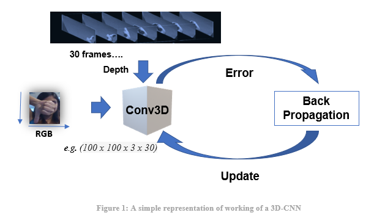
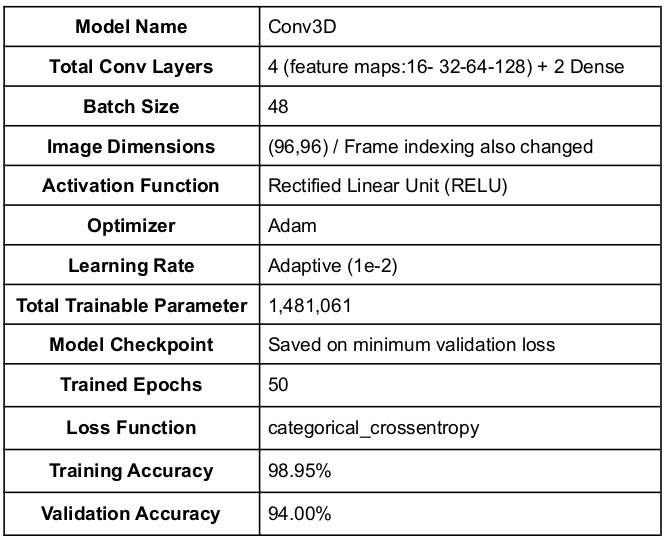

# Gesture_Recognition

## Problem Statement
In this project we are considering a cool feature for a samr-TV which can recognise five different gestures performed by the user which will help users control the TV without using a remote.

Each gesture corresponds to a specific command:

1. Thumbs up:  Increase the volume 
2. Thumbs down: Decrease the volume 
3. Left swipe: 'Jump' backwards 10 seconds 
4. Right swipe: 'Jump' forward 10 seconds 
5. Stop: Pause the movie

Each video is a sequence of 30 frames (or images) and we want to train model which can identigy the gesture for new video or action.

## Dataset
The training data consists of a few hundred videos categorised into one of the five classes. Each video (typically 2-3 seconds long) is divided into a sequence of 30 frames(images). These videos have been recorded by various people performing one of the five gestures in front of a webcam - similar to what the smart TV will use. 

## Architectures: 3D Convs and CNN-RNN Stack
For analysing videos using neural networks, two types of architectures are used commonly. One is the standard CNN + RNN architecture in which you pass the images of a video through a CNN which extracts a feature vector for each image, and then pass the sequence of these feature vectors through an RNN. 

The other popular architecture used to process videos is a natural extension of CNNs - a 3D convolutional network.

### Convolutions + RNN
The conv2D network will extract a feature vector for each image, and a sequence of these feature vectors is then fed to an RNN-based network. The output of the RNN is a regular softmax (for a classification problem such as this one).

### 3D Convolutional Network, or Conv3D
3D convolutions are a natural extension to the 2D convolutions you are already familiar with. Just like in 2D conv, you move the filter in two directions (x and y), in 3D conv, you move the filter in three directions (x, y and z). In this case, the input to a 3D conv is a video (which is a sequence of 30 RGB images). If we assume that the shape of each image is 100x100x3, for example, the video becomes a 4-D tensor of shape 100x100x3x30 which can be written as (100x100x30)x3 where 3 is the number of channels. Hence, deriving the analogy from 2-D convolutions where a 2-D kernel/filter (a square filter) is represented as (fxf)xc where f is filter size and c is the number of channels, a 3-D kernel/filter (a 'cubic' filter) is represented as (fxfxf)xc (here c = 3 since the input images have three channels). This cubic filter will now '3D-convolve' on each of the three channels of the (100x100x30) tensor.

### Data Pre-processing
• Resizing and cropping of the images. This was mainly done to ensure that the NN only recognizes the gestures effectively rather than focusing on the other background noise present in the image.

• Normalization of the images. Normalizing the RGB values of an image can at times be a simple and effective way to get rid of distortions caused by lights and shadows in an image.

• At the later stages for improving the model’s accuracy, we have also made use of data augmentation, where we have slightly rotated the pre-processed images of the gestures in order to bring in more data for the model to train on and to make it more generalizable in nature as sometimes the positioning of the hand won’t necessarily be within the camera frame always.

### Results

